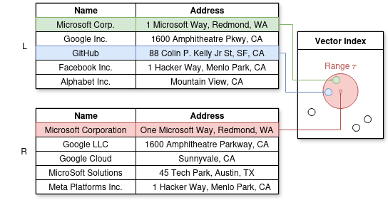
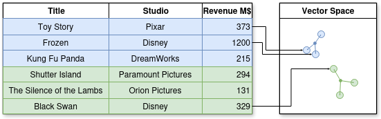

# Softening Structured Query Answering with Large Language Models 🦙🖥️🎓

This repository contains the code and resources for my master's thesis: 
"Softening Structured Query Answering with Large Language Models." 

The thesis explores how Volcano Style Relational Database Management System (RDMS) can benefit from 
integrating Large Language Models (LLMs) in query evaluation operators to soften the strict bindings. 
This allows to filter and join data on semantics rather than symbolic reasoning.

## Operators

We've integrated [7 soft-operators](db/operators), which soften the schema and data bindings. 
All operators are implemented as iterators and eiter generate tuples or map/ filter/ aggregate or join data. 
Particularly, we've implemented: 
1) [Dummy](db/operators/Dummy.py): Generates tuples according to a list of data. This operator can be compared to `VALUES` in SQL
2) [Scan](db/operators/Scan.py): Performs a semantic search for a relation in PostgreSQL database and iterates over its tuples  
3) [Select](db/operators/Select.py) $\sigma_{\text{criteria}}$: Filters Tuples according to certain criterion. This operator can be compared to `WHERE` clauses in SQL
The criterion can be constructed using the following functions criteria:
   1) Conjunction $(\text{criteria}) \lor (\text{criteria})$
   2) Disjunction $(\text{criteria}) \land (\text{criteria})$
   3) Equal $a=b$, Greater then $a \gt b$, Smaller then $a \lt b$ 
   4) Negation $\neg \text{ctiteria} $
   5) IsNull
   6) SoftEqual $a \approx b$: Checks for semantic equality using an LLM. E.g. Lady Gaga $\approx$ Stefani Joanne Angelina Germanotta
   7) SoftValidate $\checkmark_{\text{template}}$: Validates a text using an LLM. The text is constructed by filling a template with data. E.g. The validation of $\checkmark_{\text{Is the movie '{title}' about toys? }}$ for the record {title: 'Toy Story'} instructs a LLM with the prompt "Is the movie '{title}' about toys?"
4) Project $\pi_{x_1, x_2, ..., x_n}$: Re-maps the record according to the mapping functions $x_1, x_2, ..., x_n$. For all mapping functions, the operator performs a semantic search for the stated columns. We've added the following mapping functions: 
   1) Identity: Returning the record with the respective column. E.g. $\pi_{\text{title}}({\text{\{'originaltitle'': 'Toy Story', ...\}}}) \rightarrow \text{\{'title': 'Toy Story'\}}$
   2) Rename: Retuning the record with a renamed column name. E.g. $\pi_{\text{title}\rightarrow\text{newtitle}}({\text{\{'originaltitle'': 'Toy Story', ...\}}}) \rightarrow \text{\{'newtitle': 'Toy Story'\}}$
   3) Math Operation: Applies a mathematical function to a record. E.g. $\pi_{\text{price} \cdot 5, \text{amount} + 1}({\text{\{'price': 10, 'orderamount': 2 ...\}}}) \rightarrow \text{\{'price': 50, 'amount': 3\}}$
   4) String Concat: Concatenates column values to a single column. E.g. $\pi_{\text{CONCAT('Hello {name}, good to see you')}\rightarrow\text{greeting}}({\text{\{'name': 'Robert', ...\}}}) \rightarrow \text{\{'greeting': 'Hello Robert, good to see you'\}}$
   5) TextGeneration: Instructs an LLM with a prompt generated from the record. Can be used for a full in-database RAG pipeline. E.g. $\pi_{\text{LLM('Hello {name}, good to see you')}\rightarrow\text{greeting}}({\text{\{'name': 'Robert', ...\}}}) \rightarrow \text{\{'greeting': 'I'm not actually Robert, but I'll play along. It's nice to meet you! How can I assist you today?'\}}$
5) Join $L \bowtie_{\text{condition}} R$: Joins two relations according a certain condition.  This operator can be compared to `JOIN` in SQL. We implemented 3 types of Joins:
   1) NestedLoopJoin: Can perform a join on any condition. However, it is internally executed as $\sigma_{\text{condition}}(L \times R)$, therefore has a $\mathcal{O}(|L| \times |R|)$ runtime.  
   2) HashJoin: Implements an InnerEquiJoin $L \bowtie_{L.x = R.y} R$ by building a hash table on the join attributes and returning the merged tuples in the same buckets 
   3) SoftJoin: Implements an InnerSoftEquiJoin $L \bowtie_{L.x \approx R.y} R$ by building a vector index on the embedded join attributes and returning the merged tuples within the same radius. Optionally, a semantic entity matching can be added. ([Example](#soft-join))  
6) Aggregate $(g_1, g_2, ..., g_n)\gamma_{f_1 \rightarrow c_1, f_2 \rightarrow c_2, ..., f_m \rightarrow c_m}(R)$: Aggregates the records in relation according to the variables $g_1, g_2, ..., g_n$ and executes the aggregation functions on the records list $f_1, f_2, ..., f_m$ (stores them as $c_1, c_2, ..., c_m$. Returns the tuple $\{g_1, g_2, g_m, ..., c_1, c_2, ..., c_m\}$ We've implemented aggregation function such as SumAggregate (`SUM(x)`), \[Distinct\]CountAggregate (`COUNT(x)`, `COUNT(DISTINCT x)`) and Min-/ MaxAggregate (`MIN`) (`MAX`). This operator can be compared to `GROUP BY` in SQL. We've implemented 2 types of Aggregation methods:
   1) HashAggregate: Default aggregate implementation (softens schema bindings by semantic searching for stated columns). Aggregates the records in a hash table and applies the aggregation for all values for a key. E.g.: $(\text{category}, \text{name})\gamma_{SUM(\text{amount}) \rightarrow \text{ordersamount}, COUNT(\text{orderid}) \text{totalorders}}(\text{{category: 'Food', name: 'Coffee', amount: 1, orderid: 0}, {category: 'Food', name: 'Coffee Kart', amount: 3, orderid: 1}}) \rightarrow \text{{category: 'Food', name: 'Coffee', ordersamount: 4, totalorders: 2}}$     
   2) SoftAggregate: Performs a semantic aggregation by embedding the serialized key values using a LLM. To generate buckets, the vector space is clustered and the set of keys and the set of aggregates values is returned. ([Example](#soft-aggregate))      
7) Union $\cup$: Union set operation on tuples/records. This operator can be compared to `UNION` in SQL.

### Soft Join 

Here, we demonstrate how SoftJoin creates joins for the example query: 

$$
   (\text{Companies1 c1})\bowtie_{\text{name,address}}(\text{Companies2 c2})
$$

The first step is the serialization of the join values of the left relation.
The record {'Name': 'Microsoft Corp.', 'Address': '1 Microsoft Way, Redmond, WA'} is converted to "Microsoft Corp., 1 Microsoft Way, Redmond, WA".
This string representation of the key values is then embedded into a dense vector using a LLM and inserted into a vector index, which is able to perform range queries (e.g. [faiss](https://github.com/facebookresearch/faiss)). 

When the left relation is processed, the operator iterates over the right relation. 
The key values of the right relation are also serialized and embedded. 
Then, the vector index is queried with the embedding and using the range of the hyperparameter $\tau$. 
All resulting records are considered as potential join partners. 

We've illustrated this procedure in the following visualization. 
Here, the green and blue circle represent the dense vectors of the records 'Microsoft Corp.' and 'GitHub' from the left relation 'Companies1'.
The red circle illustrates the range query for the embedding of the 'Microsoft Corporation' record from the right relation 'Companies2'.
Since 'Microsoft Corp.' and 'GitHub' are in range of $\tau$, they are treated as join candidates. 

<p align="center">
   
</p>

For all potential join candidates, a second evaluation is performed. Here, the serialized strings are passed into an entity matching LLM. 
This LLM is instructed with a prompt such as "Are the records {serialize(record$_l$)} and {serialize(record$_r$)} the same?".
If the LLM infers true, the operator yields the merged tuple, otherwise it continues with the next partner. 

This second evaluation is employed to avoid false positives such as 'Microsoft Corp.' and 'MicroSoft Solutions', 
which may have a close embedding, even though they are semantically not the same.  

Note, that the Hyperparameter $\tau$ has to be chosen for a high recall (e.g. $0 < \tau \ll 1$ for Cosine Similarity), 
since all relevant join candidates should be available for the second evaluation. 
A $\tau = 0$ is equal to $\sigma_{\checkmark (R \approx L)}(R \times L)$.

### Soft Aggregate 

Here, we demonstrate how SoftAggregate creates aggregations for the example query: 

$$
   (\text{Title}, \text{Studio})\gamma_{SUM(\text{Revenue}) \rightarrow \text{totalrevenue}}(\text{Movies})
$$

The first step is the serialization of the key values. 
The record {'Title': 'Toy Story', 'Studio': 'Pixar', 'Revenue M$': 373} is converted to "Toy Story, Pixar". 
This string representation of the key values is then embedded into a dense vector using a LLM and inserted into a vector space. 

When all tuples are processed, a cluster algorithm such as [KMeans](https://scikit-learn.org/stable/modules/generated/sklearn.cluster.KMeans.html) or [DBSCAN](https://scikit-learn.org/stable/modules/generated/sklearn.cluster.DBSCAN.html) is applied on the vectors.

The following visualization shows how a vector space may look like. 
The clusters represent the cluster membership with the small blue dots as centroids.   

<p align="center">
   
</p>

For every element in a cluster, the aggregation function is applied. In this example, we've got two clusters with 3 elements each. 
So, the algorithm evaluates: 
* {{'Title': 'Toy Story', 'Studio': 'Pixar'}, {'Title': 'Frozen', 'Studio': 'Disney'}, {'Title': 'Kung Fu Panda', 'Studio': 'DreamWorks'}} <br>
  $\rightarrow SUM_{\text{revenue}}([\text{{'revenue' : 373}}, \text{{'revenue' : 1200}}, \text{{'revenue' : 215}}]) = 1788$
* {{'Title': 'Shutter Island', 'Studio': 'Paramount Pictures'}, {'Title': 'The Silence of the Lambs', 'Studio': 'Orion Pictures'}, {'Title': 'Black Swan', 'Studio': 'Disney'}} <br>
  $\rightarrow SUM_{\text{revenue}}([\text{{'revenue' : 294}}, \text{{'revenue' : 131}}, \text{{'revenue' : 329}}]) = 754$

## Installation

```bash
python3 -m venv .venv
source .venv/bin/activate
pip3 install -r requirements.txt

```

### Google Colab, 
To run the software in Google Colab, insert the following cell at the start : 
```
%%capture
!git clone https://github.com/HackerBschor/SofteningQueryEvaluation
%cd SofteningQueryEvaluation

!pip3 install faiss-gpu-cu12
!pip3 install pgvector
```

```
from huggingface_hub import notebook_login
notebook_login()
```


## Usage

To create a query, the operators have to be assembled as relational algebra. 
The soft operators usually require an embedding model or a semantic validation.  

To achieve good results, a threshold $\tau$ for semantic equality has to be selected. 
This parameter vary among tasks and data. 

We've provided example queries in the [Demo notebook](Demo.ipynb)

## Evaluation

We've evaluated the system using different strategies. 
All evaluations can be found in the respective notebooks in [evaluation folder](evaluation).

* [Data Integration](evaluation/EvaluationDataIntegration.ipynb): 
How effective can the system merge the data from two different sources (e.g. $(\text{iTunes Music i}) \bowtie_{a.title \approx i.title \land i.artist \approx i.artist \land ...} (\text{Amazon Music a})$)

* [Data Clustering](evaluation/EvaluateClustering.ipynb):
How effective can the system determine clusters (groups) in data (e.g. use $(title, artist, ...)\gamma_{Set(id) \rightarrow ids}(Songs)$ to
determine that `{"title": "Alejandro (Skrillex remix), "artist": "Lady Gaga"}` and `{"title": "004-Alejandro (Skrillex remix)", "artist": "Lady Gaga"}`
relate to the same song.
 
* [Semantic Filtering](evaluation/SemanticFiltering/EvaluateProducts.ipynb):
How effective can the system filter for records using semantic equality (e.g. use $\sigma_{\text{name} \approx \text{'Mobile Phone'}}(Products)$ to
determine that `{"name": "apple iphone 8 plus 64gb silver"}` relates to a 'Mobile Phone'. 


## Configuration

```ini
[DB]
database=<database>
host=<host>
user=<user>
password=<password>
port=<port>

[MODEL]
huggingface_token = <token>
open_ai_key = <token>
google_aistudio_api_key=<token>
```
