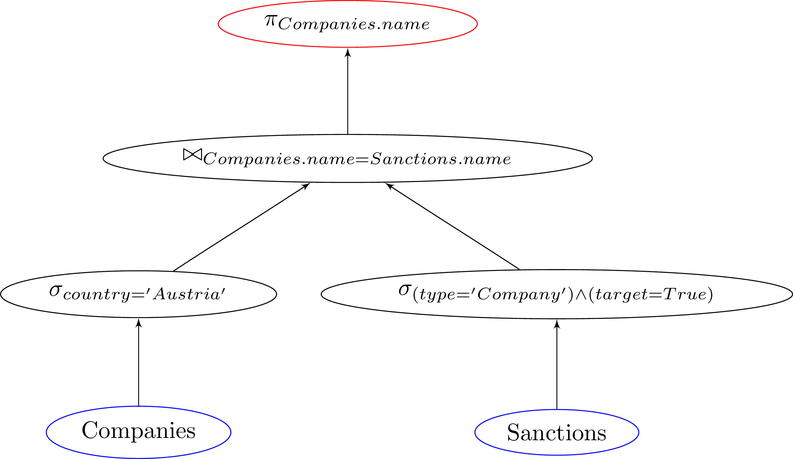
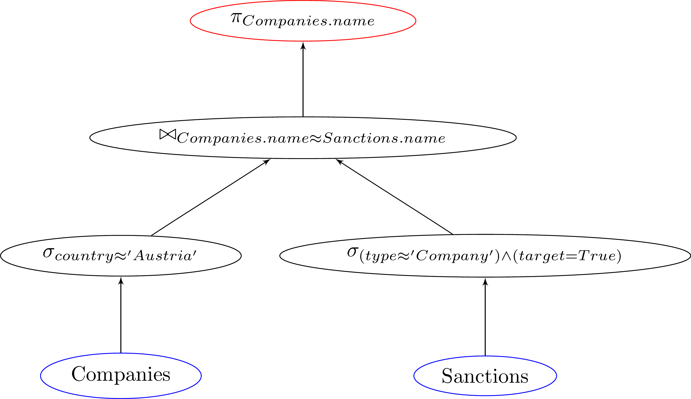

# Softening Structured Query Answering with Large Language Models 🦙🖥️🎓

This repository contains the code and resources for my master's thesis: 
"Softening Structured Query Answering with Large Language Models." 

The thesis explores how Volcano Style Relational Database Management System (RDMS) can benefit from 
integrating Large Language Models (LLMs) in query evaluation operators to soften the strict bindings. 
This allows to filter and join data on semantics rather than symbolic reasoning. 
Furthermore, we introduce a new TextGeneration-Operator $\mathcal{T}_{\text{prompt}}$ that generates text from DB input, allowing an easy RAG pipeline. 
We show that all soft operators, including the new TextGeneration-Operator, align with the Volcano Style model.

## Installation

```bash
python3 -m venv .venv
source .venv/bin/activate
pip3 install -r requirements.txt
```

## Configuration

The data

```ini
[DB]
database=<database>
host=<host>
user=<user>
password=<password>
port=<port>

[MODEL]
huggingface_token = <token>
open_ai_key = <token>
google_aistudio_api_key=<token>
```

## Execution Plan Visualizations (Optional) 

To create visualizations of the execution plan, we use:
 * [dot2tex](https://dot2tex.readthedocs.io) (Installation as stated on their Website)
 * Latex (`sudo apt-get install texlive-pictures texlive-science texlive-latex-extra latexmk`)

To create the graphs, we use the [Visualizator](utils/Visualizator.py#L13)

|              Hard Query              |              Soft Query              |
|:------------------------------------:|:------------------------------------:|
|  |  |
